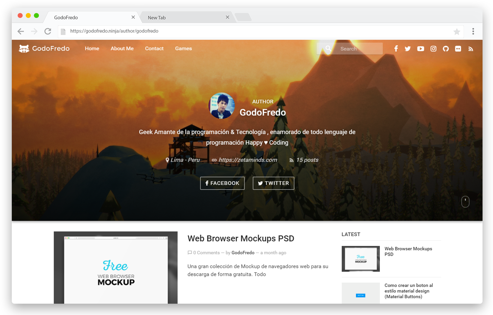
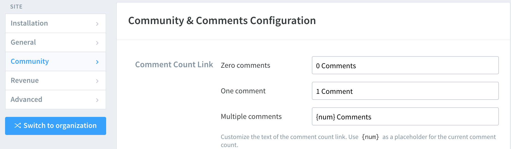
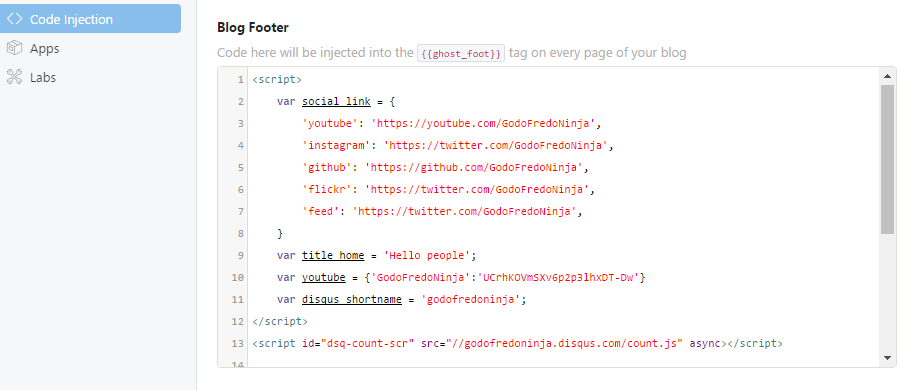
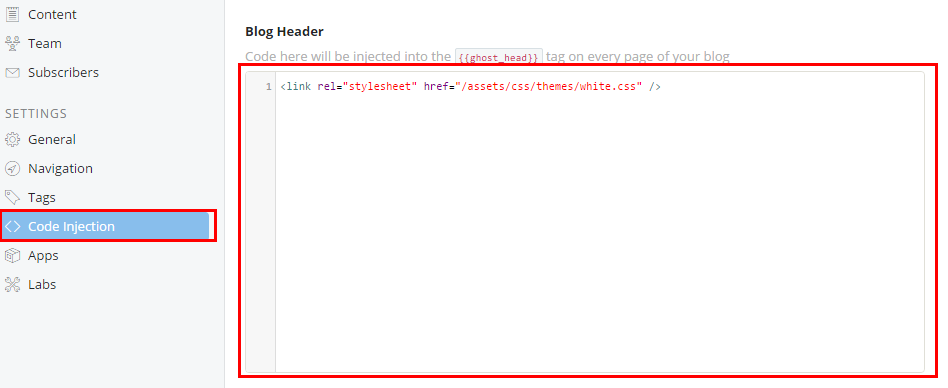
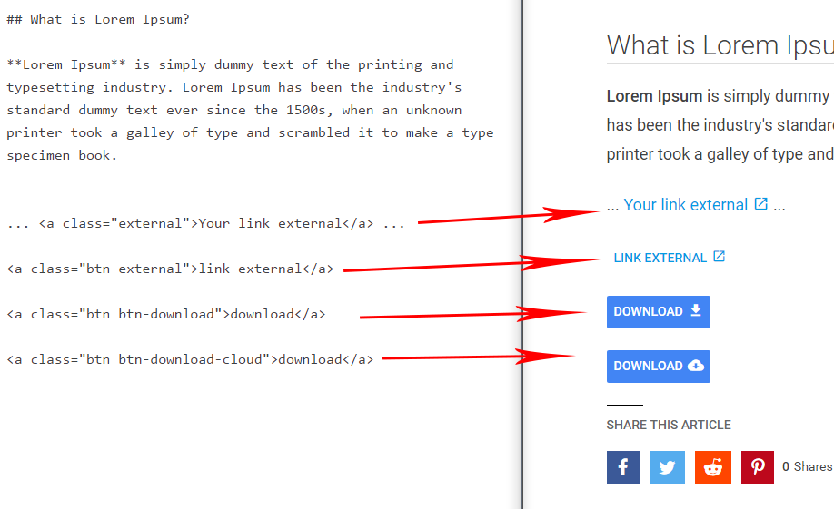
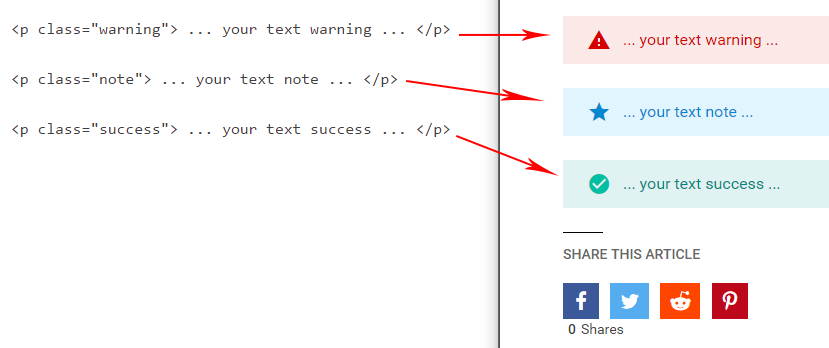
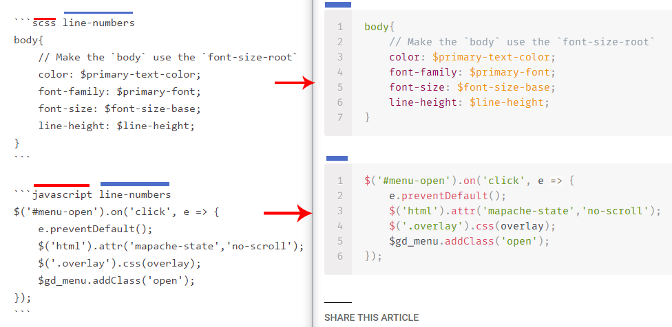
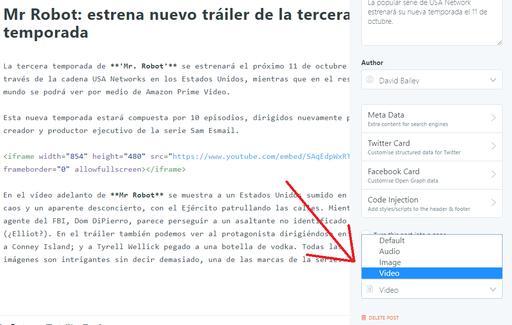
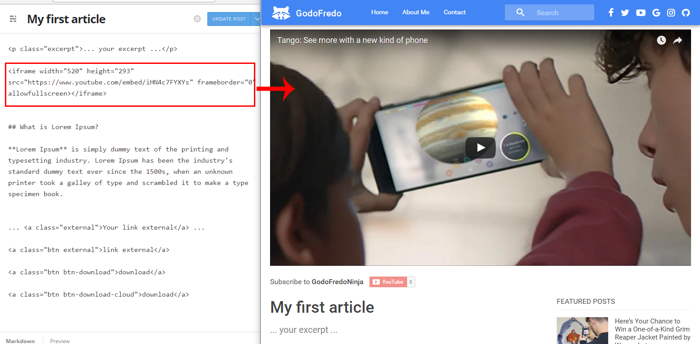

# Mapache for [Ghost](https://github.com/tryghost/ghost/) by GodoFredo

[](https://ghost.org/)
[](https://nodejs.org/en/)
[](http://bit.ly/DonateMapacheGhost)

> Minimalist Material Design and Elegant theme for [Ghost](https://github.com/tryghost/ghost/).

### Free theme for Ghost

Hello, I created this theme Ghost to see how it works. It is available for free so you can use on your site. It is strictly forbidden commercial use. If you have any suggestions to improve the theme,  you can send me tweet to [@GodoFredoNinja](http://bit.ly/tw-GodoFredoNinja)




## Demo
You can see a demo in my [blog](http://bit.ly/GodoFredoNinja-blog).

## Mapache Support for Web Browsers
Mapache supports the following web [browsers](http://caniuse.com/#search=flexbox)

## Featured
- Responsive layout
- Blog navigation
- Page 404 (Multiple faces emoticons)
- Page subscribe
- Pagination Infinite Scroll
- Cover images for blog, tag and author
- links to followers in social media
- Related Articles (6 articles)
- Video Post Format
- Image post Format
- 5 articles featured in the home of the page section sidebar
- 5 articles latest posts in the (author - tag - post) section sidebar
- 10 Tags in the sidebar
- Previous and next button in the Post
- Support for comments (Facebook or Disqus)
- Support for counter comments (Facebook or Disqus)
- Buttons to share the article
- Counter shared articles on Facebook
- YouTube, Vimeo, kickstarter -> Video Responsive
- Code syntax [Prismjs](http://prismjs.com/index.html) Supported all syntax.


### Replace Favorite icon
Create an image icon with these dimensions with the name icon.png `155px * 155px` in ` Copy your new favorite icon to ./assets/img/icon.png`


## Mapache settings
- Enable **all** checkboxes on the labs page in your Ghost admin panel.


- Copy the below script to Settings -> Code Injection  -> Blog Footer section.

### Social Links
Add the Social Links only for the services you want to appear in the header section of your website. Pay attention as enabling too many services will cause menu problems.

### Title
This section will display the desired title name in the browser tab

### YouTube Subscribe Button
This section enables the YouTube Post format. Add the Channel Name and Channel ID which can be found here [YouTube Advanced Settings](https://www.youtube.com/account_advanced)

``` html
<script>
/* links to followers in social media */
var followSocialMedia = {
  'google': 'https://...',
  'youtube': 'https://...',
  'instagram': 'https://...',
  'snapchat': 'https://...',
  'dribbble': 'https://...',
  'github': 'https://...',
  'linkedin':'https://...',
  'spotify':'https://...',
  'codepen':'https://...',
  'behance':'https://...',
  'flickr':'https://...',
  'pinterest':'https://...',
  'feed':'https://...',
};

/* Title for home Page */
var homeTitle = '... your title ...';

/* Btn Home <SUBSCRIBE> */
var homeBtn = {'... Name Btn ...':'https://...'};

/* Youtube button subscribe for post video format */
var youtubeChannel = {'YOUR_CHANNEL_NAME':'YOUR_CHANNEL_ID'};

/* Disqus for Comments */
var disqusShortName = 'YOUR_DISQUS_SHORTCUT_HERE';

</script>

<!-- Disqus Comments Count-->
<script id="dsq-count-scr" src="//YOUR_DISQUS_SHORTCUT_HERE.disqus.com/count.js" async></script>

```
## Enable Disqus or Facebook Comments
This seciton will cover how to cover Disqus of Facebook commenting into the theme. Only enable either Disqus or Facebook comments.

### Disqus Comments
To enable Disqus comments update the code in ` Settings -> Code Injection -> Blog Footer `.

Insert your [Disqus shortname](https://shortname.disqus.com/admin/) in both the comments and Disqus comment count sections.

To ensure the Disqus comment count is working correctly verify that the Disqus settings -> Comment & Community Configuration is set as seen below.


### Facebook Comments
To use facebook comments, skip the configuration Disqus.

This enables comments and comment counter

1. Add the code in Settings -> Code Injection -> Blog Header

  ```html
  <style>
    .mapache-disqus{
      display: none !important;
    }
    .mapache-facebook{
      display: inline !important;
    }
  </style>
```
2. Add the code `Settings -> Code Injection -> Blog Footer`

  ```html
    <div id="fb-root"></div>
    <script>(function(d, s, id) {
      var js, fjs = d.getElementsByTagName(s)[0];
      if (d.getElementById(id)) return;
      js = d.createElement(s); js.id = id;
      js.async=true;
      js.src = "//connect.facebook.net/en_US/sdk.js#xfbml=1&version=v2.8";
      fjs.parentNode.insertBefore(js, fjs);
    }(document, 'script', 'facebook-jssdk'));</script>
  ```




## Change Theme Style
To change the color of the Mapache theme select one of the theme styles below and copy it into the Setting -> Code Injection -> Blog Header

```html
<!-- Theme indigo -->
<link rel="stylesheet" href="/assets/css/themes/indigo.css"/>
<!-- Theme dark blue -->
<link rel="stylesheet" href="/assets/css/themes/dark-blue.css"/>
<!-- Theme blue semi dark -->
<link rel="stylesheet" href="/assets/css/themes/blue-semi-dark.css"/>
<!-- Theme blue -->
<link rel="stylesheet" href="/assets/css/themes/blue.css"/>
<!-- Theme Grey -->
<link rel="stylesheet" href="/assets/css/themes/grey.css"/>
<!-- Theme dark cyan -->
<link rel="stylesheet" href="/assets/css/themes/dark-cyan.css"/>
<!-- Theme purple -->
<link rel="stylesheet" href="/assets/css/themes/purple.css"/>
<!-- Theme teal -->
<link rel="stylesheet" href="/assets/css/themes/teal.css"/>
<!-- Theme Green -->
<link rel="stylesheet" href="/assets/css/themes/green.css"/>

<!-- For theme white add two-color logo 230px * 130px -->

<!--
  ***** 230px *****
  *               *
  ***************** 130px
  *               *
  *****************
-->


<link rel="stylesheet" href="/assets/css/themes/white.css"/>

```




### Add additional content to the sidebar
Add you own custom content into the side bar by editing the `./partials/sidebar.hbs` file.

```html

<div class="sidebar-items">
  <div class="sidebar-title">...your title...</div>
  ... your content ...
</div>

<!-- Add sticky content to the bottom -->
<div class="sidebar-sticky">
  <h3 class="sidebar-title">...your title sticky ...</h3>
  ... your content sticky ...
</div>

```


### Buttons
Format your hyperlinks with some really cool buttons. Check out the different button options here. Add these buttons directly into your blog posts.

```html
... <a class="external" href="http://..." >Your link external</a> ...

<a class="btn external" href="http://..." >link external</a>

<a class="btn btn-download" href="http://..." >download</a>

<a class="btn btn-download-cloud" href="http://..." >download</a>
```



### Warning - Note - Success
Add some more styling options to your articles text with these three styles.

```html
<p class="warning"> ... your text warning ... </p>

<p class="note"> ... your text note ... </p>

<p class="success"> ... your text success ... </p>
```



### PrismJS code syntax

Make your code stand out. WIth the PrismJS code highlighter. PrismJS allows you to select which languge you embeded and performs code highlighting according to the language. Neat!

Take a look at the [Prismjs Supported Language List](http://prismjs.com/#languages-list)

 to find your coding language.

## Video Post Format
If you want to have a video post format, you only have to add the tag `#video-post-format` . The first video in the article will be large in size.





## Image Post Format
If you want to have a image post format, you only have to add the tag `#image-post-format` The Featured image will become large in size


### Credits
- [Normalize](https://necolas.github.io/normalize.css/)
- [Jquery.ghostHunter](https://github.com/jamalneufeld/ghostHunter)
- [Prismjs](http://prismjs.com/)
- [sticky-kit](https://github.com/leafo/sticky-kit)

## Copyright & License

Copyright (c) 2016 @GodoFredoNinja - Released under the [MIT license](LICENSE).
