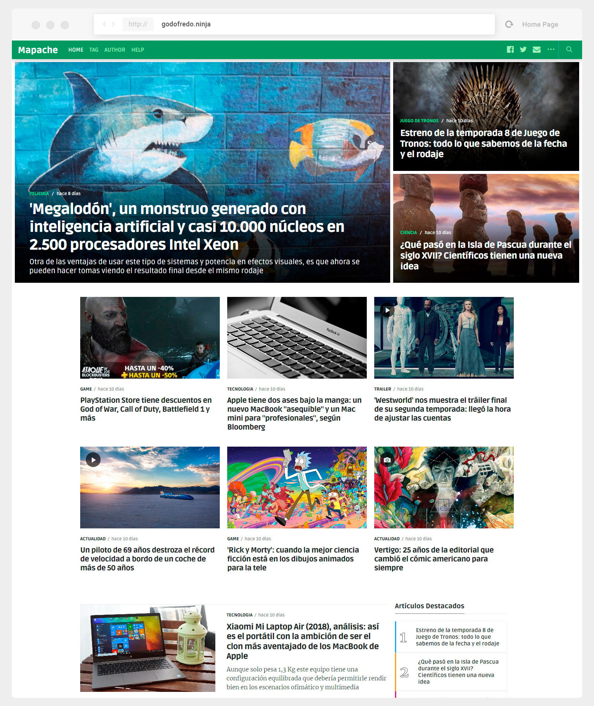
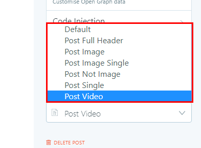
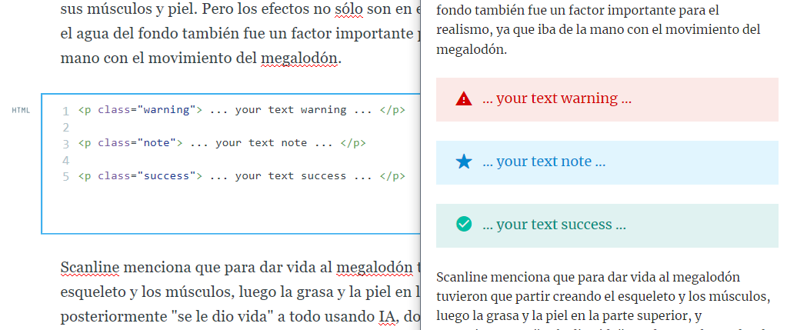
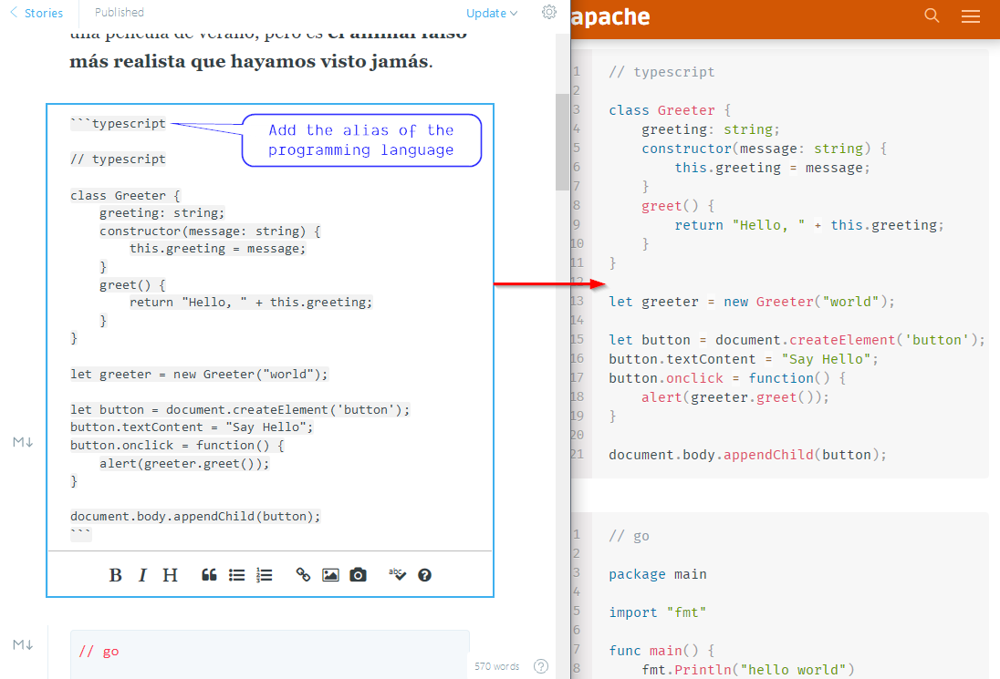
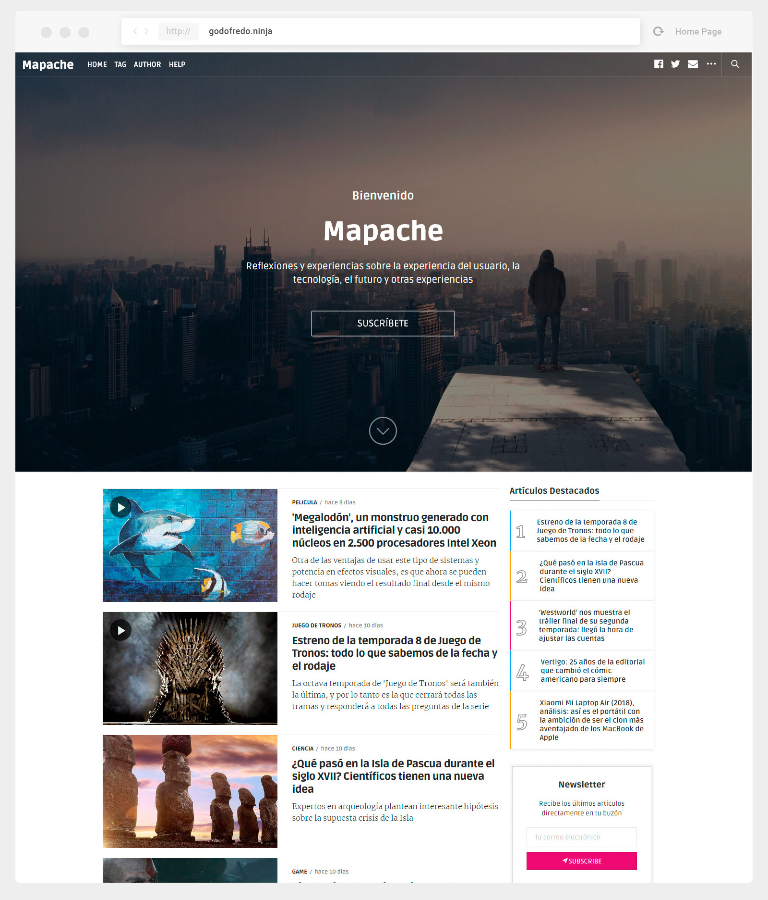

# Mapache free theme for [Ghost](https://github.com/tryghost/ghost/)

[](https://github.com/TryGhost/Ghost)
[](https://bit.ly/PayPal-GodoFredoNinja)

> Minimalist Material Design and Elegant theme.

Hi. I created this theme for ghost especially for you.
It is available for free so you can use on your site. It is strictly forbidden to use it for commercial use. If you have any suggestions to improve the theme,  you can send me a tweet [@GodoFredoNinja](https://goo.gl/y3aivK)

## If you have a ❤ heart and value my work. 🙏 Please, help me with a small donation on [Paypal](https://bit.ly/PayPal-GodoFredoNinja). It'll help motivate me to update the theme with many improvements

[](https://bit.ly/PayPal-GodoFredoNinja)



## Demo

You can see mapache in action on my Page [Demo](https://goo.gl/V7moIY)

## Featured

- Support for different [languages](http://themes.ghost.org/docs/i18n#section-how-to-add-any-language) (en - es - de - ko - fr)
- Responsive layout
- Magazine style home page or personal blog style
- 404 error page (emoticons — last 6 articles)
- Page subscribe
- Pagination Infinite Scroll
- Instagram Feed in footer of Post
- Optional menu at the footer of the page
- [AMP](https://github.com/godofredoninja/Hodor-AMP-Template-for-Ghost) Template (Accelerated Mobile Pages)
- Follow on Social Media
- Related Articles (6 articles)
- Template - Post single
- Template - Post full header
- Template - Video post format
- Template - Image post format
- Template - Image single post format
- Template - not image post => featured image is not displayed
- 5 featured articles in the sidebar (home - tag - author)
- 5 lates articles in the sidebar (post)
- Tag Cloud in the sidebar
- Previous and next articles buttons
- Support for comments (Facebook or Disqus)
- Support for counter comments (Facebook or Disqus)
- Buttons to share the article (Facebook - Twitter - Reddit - Linkedin - Pinterest - Whatsapp)
- Sticky content in the sidebar
- YouTube, Vimeo, kickstarter, Facebook, dailymotion => Responsive
- Lazy image loading for better performance only in backgrounds
- Code syntax [Prismjs](http://prismjs.com/index.html#languages-list) Supported all syntax.

## Web Browser Support for mapache

mapache supports the following web [browsers](https://caniuse.com/#search=CSS%20Variables)

## Ghost settings

- **Enable the following checkboxes on the labs page in your Ghost admin panel.**


## Mapache settings

— Copy the below script to `Code Injection  -> Blog Footer`

```html
<script>
/*====================================================
  MAPACHE SETTINGS & GLOBAL VARIABLES
====================================================*/

/* 01. Social Media Follow - Optional
 * facebook and twitter is not necessary because I use them from the ghost settings
 * add only what you need
 */
var followSocialMedia = {
  'google': 'https://...',
  'youtube': 'https://...',
  'instagram': 'https://...',
  'snapchat': 'https://...',
  'dribbble': 'https://...',
  'github': 'https://...',
  'linkedin':'https://...',
  'spotify':'https://...',
  'codepen':'https://...',
  'behance':'https://...',
  'flickr':'https://...',
  'pinterest':'https://...',
  'telegram':'https://...',
  'discord':'https://...',
  'rss':'https://...',
};

/* 02. Instagram - Optional
 * It will only be shown in the footer of the posts.
 */
var instagramToken = 'Token_app_instagram';
var instagramUserId = 'User_ID';
var instagramUserName = 'User_Name';

/* 03. Footer Menu - Optional */
var footerLinks = {
  'MENU 1': 'https://example.com',
  'MENU 2': 'https://example.com',
  'MENU 3': 'https://example.com',
};

/* 04. Comments (Disqus or Facebook) */

/* Disqus Comment Settings */
var disqusShortName = 'YOUR_DISQUS_SHORTCUT_HERE';

/* Facebook Comments Settings
 * Changing the Language (en_US - es_ES - es_LA) more information link below
 * https://developers.facebook.com/docs/plugins/comments/#language
 */
var facebookLocaleComments = 'en_US';

/* 05. Twitter Widget Settings - optional */
var twitterUserName = 'YOUR_TWITTER_USER_NAME';
var twitterNumber = 2;


/* The following configuration is optional
 * only if you have activated the personal blog design
 *====================================================*/

 /* 06. Title for home Page */
var homeTitlee = '... your title ...';

/* 07. Home BTN <SUBSCRIBE> */
var homeBtnTitlee = 'Name BTN';
var homeBtnURLe = 'https://...';

</script>
```

## Publication Language

**Mapache supports:**

- `en` — English default language
- `es` — Español
- `de` — German - By [Frederik Niedernolte](https://github.com/MaluNoPeleke)
- `ko` — Korean - By [SHGroup](https://github.com/sunghun7511)
- `fr` — French - By [Letroll](https://github.com/letroll)


if you want to have in another language you just have to copy `locales>en.json` and rename the file then translate to your favorite language:

Just enter the [language/locale tag](https://www.w3schools.com/tags/ref_language_codes.asp) of the files to use (e.g.: `fr.json` for French, `zh.json` for Chinese, `ja.json` for Japanese)

## Post Format

 Mapache has different templates for post formats. I will mention some of them.

 

 1. **Post Full Header** — It will have the full title of the post and will include the sidebar.

 2. **Post Image** — This template will have a very large featured image and the header background will also be transparent and include the sidebar. optional you can add the internal tag `#image` in your post so that you can see the image icon in the instories.

 3. **Post Image Single** — It's similar to post image. The difference is that you won't have a sidebar.

 4. **Post Video** — the first video found will move to the top of the page. you can add the internal tag `#video` in your post so that you can see the image icon in the instories and filter related video to show below the video at the top of the page.
    - vimeo
    - Dailymotion
    - Youtube
    - Vid
    - kickstarter

> Add video where convenient. When you change the theme you will not have problems and not have Problem in your AMP Template

### Add additional content to the sidebar

Add you own custom content into the side bar by editing the `./partials/sidebar.hbs` file.

```html
<!-- Add your content to the bottom -->
<div class="sidebar-items">
  <h3 class="sidebar-title u-fontSizeBase u-textColorDarker u-marginBottom20 u-fontWeightBolder">
    ...your title...
  </h3>
  ... your content ...
</div>
```

### Warning - Note - Success

> It is very important to add in the block of `Markdown` or `HTML`

Add some more styling options to your articles text with these three styles.

```html
<p class="warning"> ... your text warning ... </p>

<p class="note"> ... your text note ... </p>

<p class="success"> ... your text success ... </p>
```



### PrismJS code syntax

> It is very important to add your code in the block of `Markdown`

Make your code stand out. WIth the PrismJS code highlighter. PrismJS allows you to select which languge you embeded and performs code highlighting according to the language. Neat!

Take a look at the [Prismjs Supported Language List](http://prismjs.com/#languages-list) to find your coding language.



## Change Theme Style

To make your changes with your favorite colors you just have to add the following code and replace with your colors
[Themes](theme.md).

---

## Home Personal Blog style

if you want to have the homepage in a personal blog style, please follow these steps.

- Rename or delete the file `home.hbs`
- Edit the file `package.json` and change the number of post per page to 10.

```json
"config": {
    "posts_per_page": 10
  }
```



### Credits

- [Hodor AMP Template](https://github.com/godofredoninja/Hodor-AMP-Template-for-Ghost)
- [Normalize](https://necolas.github.io/normalize.css/)
- [Jquery.ghostHunter](https://github.com/jamalneufeld/ghostHunter)
- [Prismjs](http://prismjs.com/)
- [sticky-kit](https://github.com/leafo/sticky-kit)
- [lunr.js](https://github.com/olivernn/lunr.js)
- [zoom.js](https://github.com/fat/zoom.js/)
- [jquery-lazyload](http://www.appelsiini.net/projects/lazyload)
- [Fonts](https://fonts.google.com/?selection.family=Fira+Mono|Merriweather:400,700|Ruda:400,700,900&query=Merriweather)

## Copyright & License

Copyright (c) 2017 GodoFredoNinja - Released under the [CC BY-NC-SA 4.0](LICENSE).
