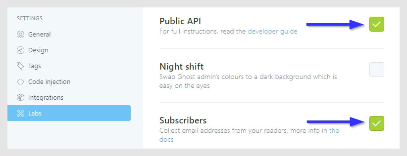
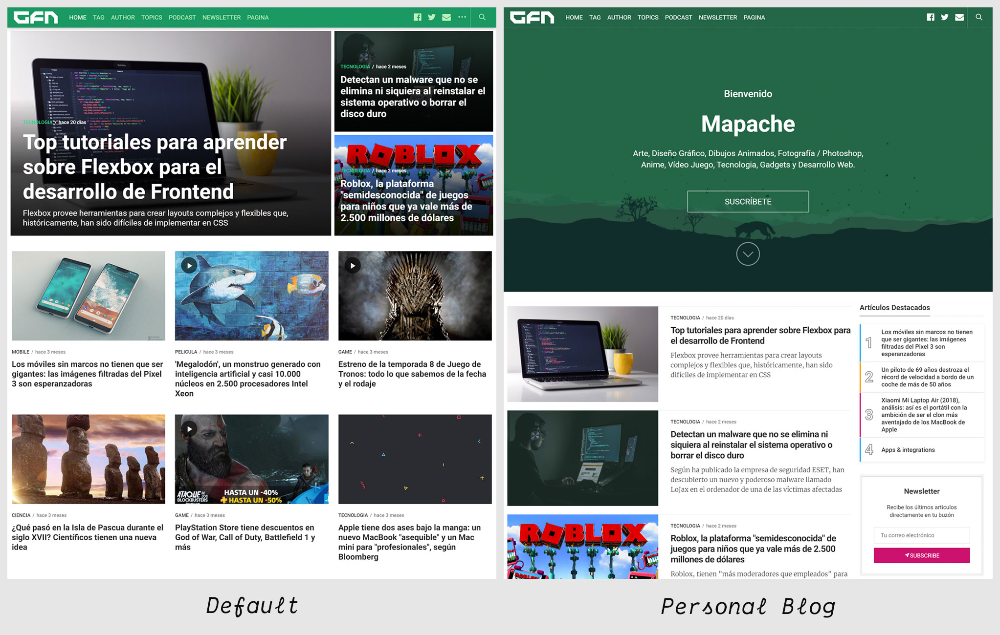
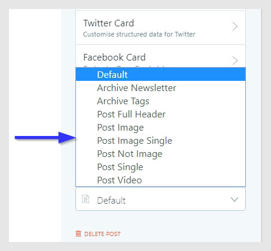
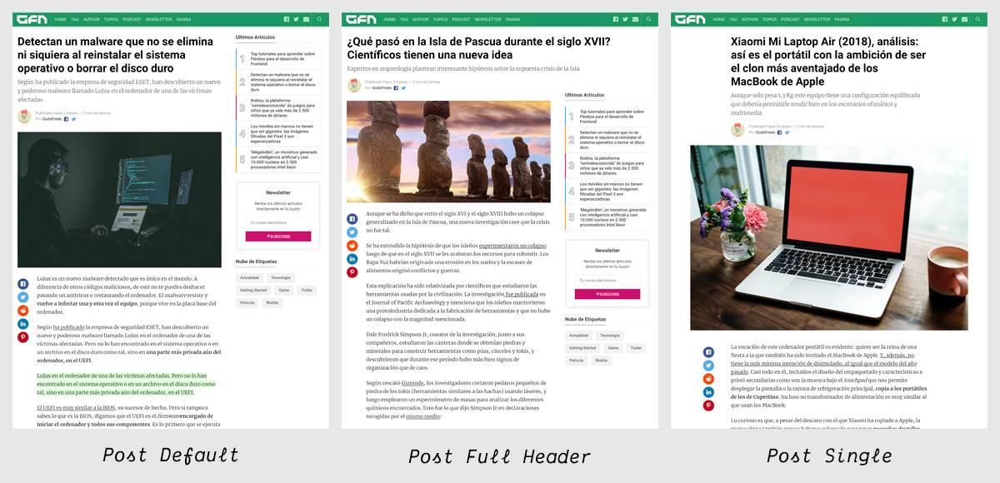
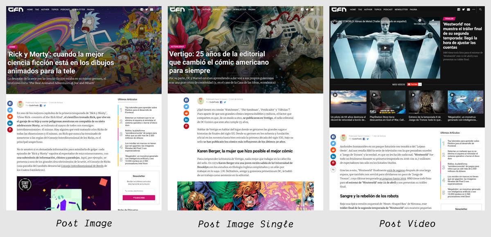
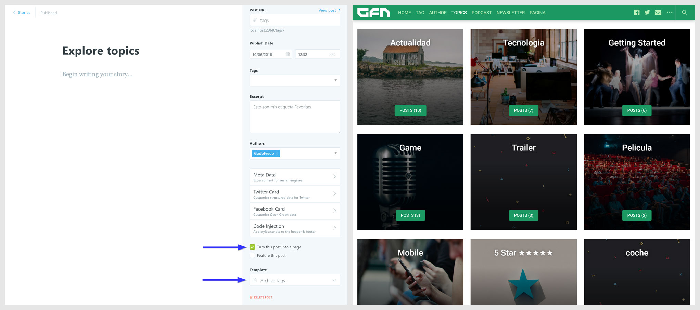
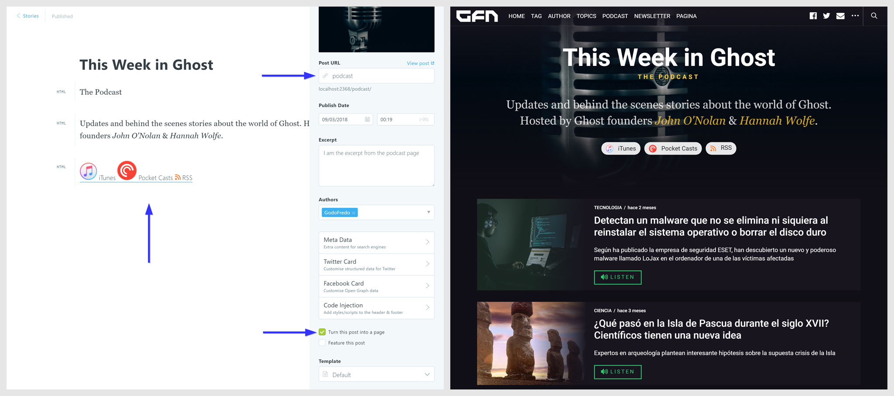
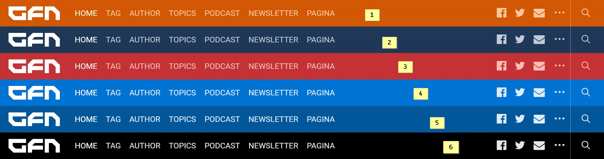

# Mapache free theme for [Ghost](https://github.com/tryghost/ghost/)

[](https://github.com/TryGhost/Ghost)
[](https://www.paypal.me/godofredoninja)

> Minimalist Material Design and Elegant theme.

Hi. I created this theme for ghost especially for you.
It is available for free so you can use on your site. It is strictly forbidden to use it for commercial use. If you have any suggestions to improve the theme,  you can send me a tweet [@GodoFredoNinja](https://goo.gl/y3aivK)

## 🙏 Please, help me with a small donation [here](https://www.paypal.com/cgi-bin/webscr?cmd=_s-xclick&hosted_button_id=4H53Q4RTPSFQW&source=url) or [PayPal](https://www.paypal.me/godofredoninja). It'll help motivate me to update the theme with many improvements

[](https://www.paypal.me/godofredoninja)


## Featured

- Support for different [languages](http://themes.ghost.org/docs/i18n#section-how-to-add-any-language) (en - es - de - ko - fr)
- 404 error page (emoticons — last 6 articles)
- Page subscribe
- Pagination Infinite Scroll
- Instagram Feed in footer of Post
- Optional menu at the footer of the page
- [AMP](https://github.com/godofredoninja/Hodor-AMP-Template-for-Ghost) Template (Accelerated Mobile Pages)
- Follow on Social Media
- Related Articles (6 articles)
- Different templates for the Home Page
- Different templates for publishing posts
- Page Newsletter (Mailchimp)
- Page Podcast
- Page Tag
- 5 featured articles in the sidebar (Home - Tag - Author)
- 5 lates articles in the sidebar (post)
- Tag Cloud in the sidebar
- Previous and next articles buttons
- Support for comments (Disqus)
- Support for counter comments (Disqus)
- Buttons to share the article (Facebook - Twitter - Reddit - Linkedin - Pinterest)
- Sticky content in the sidebar
- YouTube, Vimeo, kickstarter, dailymotion => Responsive
- Lazy image loading for better performance only in backgrounds
- Code syntax [Prismjs](http://prismjs.com/index.html#languages-list) Supported all syntax.

## Table of Contents

- [Web Browser Support for Mapache](#web-browser-support-for-mapache)
- [Ghost Settings](#ghost-settings)
- [Mapache Settings](#mapache-settings)
  - [1. Social Media](#1-social-media)
  - [2. Footer Menu](#2-footer-menu)
  - [3. YouTube Subscribe Button](#3-youtube-subscribe-button)
  - [4. Instagram](#4-instagram)
  - [5. Comments](#5-comments)
  - [6. Search](#6-search)
- [Theme Translation](#theme-translation)
- [AMP](#amp)
- [Home Page](#home-page)
- [Post Format](#post-format)
- [Tags Page](#tags-page)
- [Newsletter Page](#newsletter-page)
- [Podcast Page](#podcast-page)
- [Ads](#ads)
- [Change Theme Color](#change-theme-color)
- [PrismJS code syntax](#prismjs-code-syntax)

## Web Browser Support for mapache

mapache supports the following web [browsers](https://caniuse.com/#search=CSS%20Variables)

## Ghost Settings

Enable the following checkboxes on the Labs page in the Ghost admin panel.



## Mapache Settings

> You don't have to add all the Simply configurations. only the ones you need

### 1. Social Media Links

> Facebook and Twitter is not necessary because I use them from the ghost settings

Add the Social Links only for the services you want to appear in the header section of your website. Pay attention as enabling too many services will cause menu problems.

➡️ `Dashboard -> Code injection -> Site Footer`

```html
<script>
var followSocialMedia = {
  'youtube': ['YOUR_URL','YOUR_TITLE'],
  'instagram': ['YOUR_URL','YOUR_TITLE'],
  'snapchat': ['YOUR_URL','YOUR_TITLE'],
  'dribbble': ['YOUR_URL','YOUR_TITLE'],
  'github': ['YOUR_URL','YOUR_TITLE'],
  'linkedin': ['YOUR_URL','YOUR_TITLE'],
  'spotify': ['YOUR_URL','YOUR_TITLE'],
  'codepen': ['YOUR_URL','YOUR_TITLE'],
  'behance': ['YOUR_URL','YOUR_TITLE'],
  'flickr': ['YOUR_URL','YOUR_TITLE'],
  'pinterest': ['YOUR_URL','YOUR_TITLE'],
  'telegram': ['YOUR_URL','YOUR_TITLE'],
  'vimeo': ['YOUR_URL','YOUR_TITLE'],
  'twitch': ['YOUR_URL','YOUR_TITLE'],
  'vk': ['YOUR_URL','YOUR_TITLE'],
  'slack': ['YOUR_URL','YOUR_TITLE'],
  'tumblr': ['YOUR_URL','YOUR_TITLE'],
  'discord': ['YOUR_URL','YOUR_TITLE'],
  'rss': ['YOUR_URL','YOUR_TITLE'],
};
</script>
```
### 2. Footer Menu

You can add an additional menu bar at the footer of the page

➡️ `Dashboard -> Code injection -> Site Footer`

```html
<script>
var footerLinks = {
  'Menu 1': 'YOUR_URL',
  'Menu 2': 'YOUR_URL',
  'Menu 3': 'YOUR_URL',
};
</script>
```
### 3. YouTube Subscribe Button

Subscription Button of YouTube in Video Post Format. Add the Channel ID which can be found here [YouTube Advanced Settings](https://www.youtube.com/account_advanced)

➡️ `Dashboard -> Code injection -> Site Footer`

```html
<script>
var youtubeChannelID = 'YOUR_CHANNEL_ID';
</script>
```

### 4. Instagram

I get the last 10 images then show 6 randomly It will only be shown in the footer of the Post

First, you will need to get your account `userName` and `userId` and `accessToken` from the following URLs:

- User ID: [codeofaninja.com/tools/find-instagram-user-id](https://codeofaninja.com/tools/find-instagram-user-id)
- Access Token: [instagram.pixelunion.net](http://instagram.pixelunion.net/)

➡️ `Dashboard -> Code injection -> Site Footer`

```html
<script>
var instagramFeed  = {
  token: 'Token_app_instagram',
  userId: 'User_ID',
  userName: 'User_Name',
};
</script>
```

### 5. Comments

Mapache supports Disqus comments as well as comment counting

— First, you will need to get your account `disqusShortName`

➡️ `Dashboard -> Code injection -> Site Footer`

```html
<script>
var disqusShortName = 'YOUR_DISQUS_SHORTCUT_HERE';
</script>
```

### 6. Search

> The default search engine will only search the titles of the post

**Setup a Custom integration**

1. Go in your Ghost's `dashboard -> Integrations -> Add custom integration`
2. Set a name: `GodoFredo Themes Search`
3. Get the Content API Key and replace the demo key with this one
4. Get the admin domain. This will be different in some cases

➡️ `Dashboard -> Code injection -> Site Footer`

```html
<script>
  var searchSettings = {
    key: 'ADD_YOUR_API_KEY',
    url: 'https://demo.ghost.io',
  };
</script>
```

OR - Adding parameters to the search

```html
<script>
var searchSettings = {
  key: 'ADD_YOUR_API_KEY',
  url: 'https://demo.ghost.io',
  /* This is optional */
  options: {
    keys: [
        'title',
    ],
    limit: 10,
  },
  /* This is optional to perform filtering of the ghost api */
  api: {
    resource: 'posts',
    parameters: {
      limit: 'all',
      fields: ['title', 'slug'],
      filter: '',
      include: '',
      order: '',
      formats: '',
    },
  },
}
</script>
```

The search engine that includes Mapache is very powerful, supports almost all languages and you can customize to your liking.

Read more about the search engine [Read More](https://github.com/HauntedThemes/ghost-search)

### 7. Twitter widget in the sidebar

```html
<script>
var twitterFeed = {
  name: 'YOUR_TWITTER_USER_NAME',
  number: 2,
};
</script>
```

---

## Theme Translation

**Mapache supports:**

- `en` — English default language
- `es` — Spanish
- `de` — German - By [Frederik Niedernolte](https://github.com/MaluNoPeleke)
- `ko` — Korean - By [SHGroup](https://github.com/sunghun7511)
- `fr` — French - By [Letroll](https://github.com/letroll)
- `pl` — Polish - By [kacperduras](https://github.com/kacperduras)


if you want to have in another language you just have to copy `locales>en.json` and rename the file then translate to your favorite language:

Just enter the [language/locale tag](https://www.w3schools.com/tags/ref_language_codes.asp) of the files to use (e.g.: `fr.json` for French, `zh.json` for Chinese, `ja.json` for Japanese)

## AMP

— *Mapache has a nice page for **AMP***

- Navigation
- links to followers in social media
- Tags
- Related Articles (6 articles)
- Buttons to share the article (Facebook - Twitter - Whatsapp)

To customize the AMP page [read here](https://github.com/godofredoninja/Hodor-AMP-Ghost)

## Home Page

> Mapache - come with 2 Home page with different layout options

1. Masonry (Default)

2. **Personal Blog**
- Rename or delete the file `home.hbs`
- Edit the file `package.json` and change the number of post per page to 10.

```json
"config": {
  "posts_per_page": 10
}
```
— Adding additional configuration for personal blog `Settings -> Code Injection -> Blog Footer`

```html
<script>
  /* 01. Title for home - optional */
  var homeTitle = 'Hola este es mi Titulo';

  /* 02. Home BTN <SUBSCRIBE> - optional */
  var homeBtn = {
    title: 'Add_TITLE',
    url: 'Add_URL',
  };
</script>
```



## Post Format

 Mapache has different templates for post formats. I will mention some of them.

 

 1. **Post Full Header** — It will have the full title of the post and will include the sidebar.

 2. **Post Image** — This template will have a very large featured image and the header background will also be transparent and include the sidebar. optional you can add the internal tag `#image` in your post so that you can see the image icon in the instories.

 3. **Post Image Single** — It's similar to post image. The difference is that you won't have a sidebar.

 4. **Post Video** — the first video found will move to the top of the page. you can add the internal tag `#video` in your post so that you can see the image icon in the instories and filter related video to show below the video at the top of the page.
    - vimeo
    - Dailymotion
    - Youtube
    - Twitch
    - kickstarter

> Add video where convenient. When you change the theme you will not have problems and not have Problem in your AMP Template





## Tags Page

> A page will be displayed with all tags sorted from highest to lowest number of articles.

- To create the tags page you just have to create a new page
- Choose your favorite url and title
- Select the `Archive Tags` template from the Template dropdown
- Publish the page
- To add the page to the navigation



## Newsletter Page

- To create the Newsletter page you just have to create a new page
- Choose your favorite url and title
- Select the `Archive Newsletter` template from the Template dropdown
- Write the list as normal in your content
- To have the **Mailchimp** form copy the code and add an `HTML` section in Ghost then change the form action url.

Example: `<form action="https://ninja.us10.list-manage.com/subscribe/post?u=5c52d5a541f6ab2e8d6020e82&id=f5f6d462c4">`

```html
<!-- <godo-nesletter> Mailchimp -->
<div class="godo-ne">
  <!-- Replace => Action -->
  <form id="godo-form" class="godo-ne-form" action="YOUR_URL_OF_LIST_Mailchimp" method="get">
      <label for="fieldEmail">Email Address</label>
      <div class="godo-ne-form-group">
        <input id="fieldEmail" class="godo-ne-input" name="EMAIL" type="email" placeholder="yourname@example.com" required="">
        <button class="godo-ne-button button" type="submit">Subscribe</button>
      </div>
      <small>No marketing campaigns. No jibber jabber. Unsubscribe anytime.</small>
  </form>
  <div class="godo-ne-success u-hide">
    <h3>✉️ Nice! Please check your email</h3>
    <p>Click on the link in your inbox to confirm your subscription</p>
  </div>
</div>
```

- **Testimonies** Copy the code and paste into an `HTML` section in Ghost

```html
<div class="godo-n-q">

  <div class="godo-n-q-i">
    
    <h3>Tim Cook</h3>
    <div class="godo-n-q-d">CEO, Apple</div>
    <blockquote>"This is a pretty fantastic newsletter tbh, I definitely recommend it"</blockquote>
  </div>

  <div class="godo-n-q-i u-hide-before-md">
    
    <h3>Satya Nadella</h3>
    <div class="godo-n-q-d">CEO, Microsoft</div>
    <blockquote>"Finally, this newsletter is something we can really agree on"</blockquote>
  </div>

  <div class="godo-n-q-i u-hide-before-md">
    
    <h3>John O'Nolan</h3>
    <div class="godo-n-q-d">CEO, Ghost</div>
    <blockquote>"I should really get around to organising some quotes one of these days"</blockquote>
  </div>

</div>
```

- Publish the page
- To add the page to the navigation


## Podcast Page

- To create the Podcast Page you just have to create a new page
- Choose your favorite title
- Use the url `podcast`
- In your articles use the internal tags `#podcast`
- First back up your routes in your ghost settings `Labs -> Routes -> Download current routes.yml`
- Re-download the Route and edit `routes.yml` line `routes`

```yaml
routes:
  /podcast/:
    controller: channel
    filter: tag:[hash-podcast]
    data:
      post: page.podcast
    limit: 10
    template: godo-podcast
```

- In an `HTML` block in your ghost editor add this code for your content.

```html
<p class="spc-h-e">The Podcast</p>

<p class="spc-des">Updates and behind the scenes stories about the world of Ghost. Hosted by Ghost founders <em>John O'Nolan</em> &amp; <em>Hannah Wolfe</em>.</p>

<div class="spc-buttons">

    <a href="https://itunes.apple.com/">
    
    <span>iTunes</span>
  </a>

  <a href="https://www.pocketcasts.com/">
    
    <span>Pocket Casts</span>
  </a>

  <a href="https://anchor.fm/">
    
    <span>RSS</span>
  </a>

</div>
```



## Ads

Mapache has sections to add your ads.

You have to enter the following directory `partials/ad` and add in each file your ad blocks.

```bash
./partials/ad
├── ad-post-footer.hbs
├── ad-post-header.hbs
├── ad-sidebar-medium.hbs
├── ad-author-tag-footer.hbs
├── ad-author-tag.hbs
├── ad-home-top.hbs
└── ad-home-footer.hbs
```

— It is important to add the following style in your ghost settings. in the section `Code injection -> Blog Header`

```html
<style>.mapache-ad-author-tag-top,.mapache-ad-home-top,.mapache-ad-post-footer{margin-bottom:30px}.mapache-ad-author-tag-top,.mapache-ad-author-tag-footer,.mapache-ad-home-footer,.mapache-ad-post-header{margin-top:30px}</style>
```

## Change Theme Color

> It is very easy to customize with your favorite colors.



To change the color of the Mapache theme select one of the theme styles below and copy it into the:

`Setting -> Code Injection -> Blog Header`

```html
<!-- 1.- Theme Mapache Deep Orange -->
<style>:root{--primary-color:#d25704;--header-logo-color:#fff;--header-bg-color:#d25704;--header-color:#ffc79e;--header-menu-color:#ffc79e;--header-menu-color-hover:#fff4de;--header-color-hover:#fff4de;--header-color-divider:rgba(234,233,233,0.34);--footer-color-link:#d25704;--media-type-color:rgba(243,137,59,0.86);--composite-color:#007d85;--podcast-button-color:#f06e17;--newsletter-color:#d25704;--newsletter-bg-color:rgba(210,87,4,0.6)}</style>

<!-- 2.-Theme Mapache Blue Dark -->
<style>:root{--primary-color:#1e3757;--header-logo-color:#fff;--header-bg-color:#1e3757;--header-menu-color:#c1cbdb;--header-menu-color-hover:#fcffff;--header-color-divider:#687fa5;--header-color:#c1cbdb;--header-color-hover:#fcffff;--footer-color-link:#c1cbdb;--composite-color:#007d85;--newsletter-color:#1e3757;--newsletter-bg-color:rgba(30,55,87,0.6)}</style>

<!-- 3.-Theme Mapache Red -->
<style>:root{--primary-color:#c43235;--header-logo-color:#fff;--header-bg-color:#c43235;--header-menu-color:#ffbbb4;--header-menu-color-hover:#fff0ec;--header-color-divider:#e6867c;--header-color:#ffbbb4;--header-color-hover:#fff0ec;--footer-color-link:#b56566;--composite-color:#ff5b5e;--podcast-button-color:#c43235;--newsletter-color:#c43235;--newsletter-bg-color:rgba(196,50,53,0.6)}</style>

<!-- 4.-Theme Mapache Blue -->
<style>:root{--primary-color:#0273d4;--header-logo-color:#fff;--header-bg-color:#0273d4;--header-menu-color:#ddecfa;--header-menu-color-hover:#fff;--header-color-divider:#699bca;--header-color:#ddecfa;--header-color-hover:#fff;--footer-color-link:rgba(164,209,248,0.8);--composite-color:#ff5b5e;--podcast-button-color:#2ecc71;--newsletter-color:#0273d4;--newsletter-bg-color:rgba(2,115,212,0.6)}</style>

<!-- 5.-Theme Mapache Bluen Semi Dark -->
<style>:root{--primary-color:#01579b;--header-logo-color:#fff;--header-bg-color:#01579b;--header-menu-color:#ddecfa;--header-menu-color-hover:#fff;--header-color-divider:#4a77a2;--header-color:#ddecfa;--header-color-hover:#fff;--footer-color-link:rgba(164,209,248,0.8);--composite-color:#ff5b5e;--podcast-button-color:#2ecc71;--newsletter-color:#01579b;--newsletter-bg-color:rgba(2,115,212,0.6)}</style>

<!-- 6.-Theme Mapache Black -->
<style>:root{--primary-color:#000;--header-logo-color:#fff;--header-bg-color:#000;--header-menu-color:hsla(0,0%,100%,0.9);--header-menu-color-hover:#fff;--header-color-divider:#717171;--header-color:hsla(0,0%,100%,0.9);--header-color-hover:#fff;--footer-color-link:hsla(0,0%,100%,0.8);--composite-color:rgba(0,0,0,0.54);--podcast-button-color:#2ecc71;--newsletter-color:rgba(0,0,0,0.84);--newsletter-bg-color:#b1aeae}</style>
```

**➡ If you don't like the colors above, then play with your favorite colors. Just change the colors in the following code**

```html
<style>
:root {
  --primary-color:#d25704;
  --header-logo-color:#fff;
  --header-bg-color:#d25704;
  --header-color:#ffc79e;
  --header-menu-color:#ffc79e;
  --header-menu-color-hover:#fff4de;
  --header-color-hover:#fff4de;
  --header-color-divider:rgba(234, 233, 233, 0.34);
  --footer-color-link:#d25704;
  --media-type-color:rgba(243,137,59,0.86);
  --composite-color:#007d85;
  --podcast-button-color:#f06e17;
  --newsletter-color:#d25704;
  --newsletter-bg-color:rgba(210,87,4,0.6)
}
</style>
```

### PrismJS code syntax

> It is very important to add your code in the block of `Markdown`

Make your code stand out. WIth the PrismJS code highlighter. PrismJS allows you to select which languge you embeded and performs code highlighting according to the language. Neat!

Take a look at the [Prismjs Supported Language List](http://prismjs.com/#languages-list) to find your coding language.


### Credits

- [Hodor AMP](https://github.com/godofredoninja/Hodor-AMP-Ghost)
- [Normalize](https://necolas.github.io/normalize.css/)
- [Ghost Search](https://github.com/HauntedThemes/ghost-search)
- [Fuzzysort](https://github.com/farzher/fuzzysort)
- [Prismjs](http://prismjs.com/)
- [Theia Sticky Sidebar](https://github.com/WeCodePixels/theia-sticky-sidebar)
- [lightgallery.js](https://github.com/sachinchoolur/lightgallery.js/)
- [Lazysizes](https://github.com/aFarkas/lazysizes)
- [Fonts](https://fonts.googleapis.com/css?family=Merriweather:300i,400,700|Roboto|Roboto+Mono:300i,400,500,700)
- [Safari Light - Mockup](https://www.uplabs.com/posts/safari-light-version)

## Copyright & License

Copyright (c) 2017 GodoFredoNinja - Released under the [CC BY-NC-SA 4.0](LICENSE).
