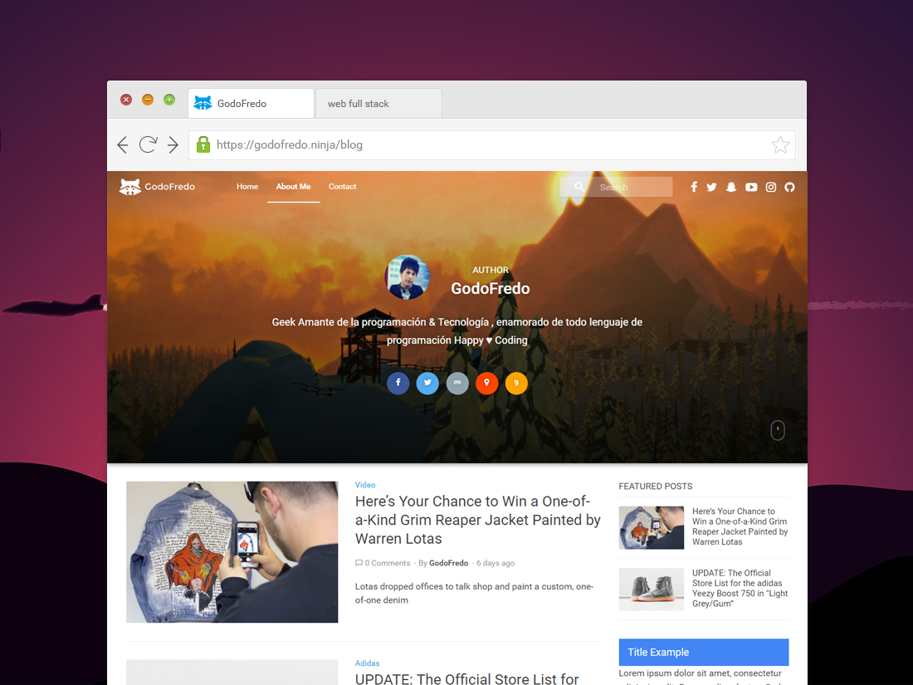
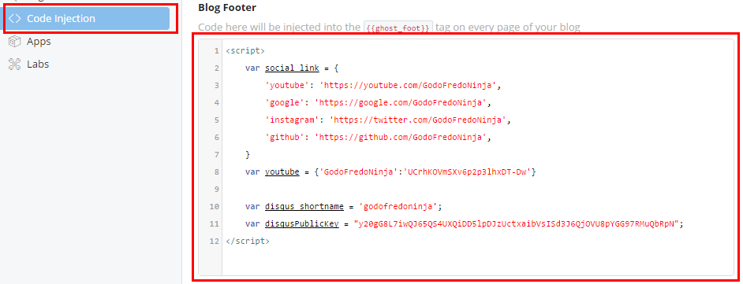

# Mapache for [Ghost](https://github.com/tryghost/ghost/) by GodoFredo

[](https://ghost.org/)
[](https://nodejs.org/en/)
[](http://bit.ly/DonateMapacheGhost)

> Minimalist Material Design and Elegant theme for [Ghost](https://github.com/tryghost/ghost/).

### Free theme for Ghost

Hello, I created this theme Ghost to see how it works. It is available for free so you can use on your site. It is strictly forbidden commercial use. If you have any suggestions to improve the theme,  you can send me tweet to [@GodoFredoNinja](http://bit.ly/tw-GodoFredoNinja)




## Demo
You can see a demo in my [blog](http://bit.ly/GodoFredoNinja-blog).

## Mapache Support for Web Browsers
Mapache supports the following web [browsers](http://caniuse.com/#search=flexbox)

## Featured
- Responsive layout
- Blog navigation
- Page 404
- Page subscribe
- Pagination Infinite Scroll
- Cover images for blog, tag and author
- Social media links
- Post related
- Post format Video
- Post format Image
- Post (5 articles) Featured in sidebar
- Disqus Comments
- Disqus Comments Count
- Sharing Buttons
- Sharing socila media Count
- YouTube, Vimeo, kickstarter -> Video Responsive
- Code syntax Supported [Prismjs](http://prismjs.com/download.html?themes=prism&languages=markup+css+clike+javascript+aspnet+bash+c+csharp+cpp+ruby+css-extras+git+go+java+json+less+markdown+perl+php+php-extras+python+jsx+scss+sql+swift&plugins=line-numbers)


## USE

### Font Icons
Icons generated by [Icomoon](https://icomoon.io/app/#/select) and import  `./assets/fonts/selection.json`


### Replace icon
Replace icon with these measures `155px * 155px` in `./assets/img/icon.png`


## Mapache settings

- Create [Api key Disqus](https://disqus.com/api/docs/)
- You have to enable via a checkbox on the labs page in your Ghost admin panel.


``` html
<script>
/* Social Media Links*/
var social_link = {
	'google': 'https://...',
	'youtube': 'https://...',
	'instagram': 'https://...',
	'snapchat': 'https://...',
	'dribbble': 'https://...',
	'github': 'https://...',
	'linkedin':'https://...',
	'spotify':'https://...',
	'codepen':'https://...',
	'behance':'https://...',
	'flickr':'https://...',
	'pinterest':'https://...',
	'feed':'https://...',
}

/*Title for home Page*/
var title_home = '... your title ...';

/*Footer menu*/   
var footer_menu = {
   '...name...': 'https://...',
   '...name...': 'https://...',
   '...name...': 'https://...',
   '...name...': 'https://...',    
}

/*Youtube button subscribe for post video format*/
var youtube = {'YOUR_CHANNEL_NAME':'YOUR_CHANNEL_ID'}

/*Disqus for Comments*/
var disqus_shortname = 'YOUR_DISQUS_SHORTCUT_HERE';
var disqusPublicKey = "YOUR_DISQUS_API_KEY";
</script>
```




## Add Style Theme

```html
<!-- Theme indigo -->
<link rel="stylesheet" href="/assets/css/themes/indigo.css"/>
<!-- Theme dark blue -->
<link rel="stylesheet" href="/assets/css/themes/dark-blue.css"/>
<!-- Theme blue semi dark -->
<link rel="stylesheet" href="/assets/css/themes/blue-semi-dark.css"/>
<!-- Theme blue -->
<link rel="stylesheet" href="/assets/css/themes/blue.css"/>
<!-- Theme Grey -->
<link rel="stylesheet" href="/assets/css/themes/grey.css"/>
<!-- Theme dark cyan -->
<link rel="stylesheet" href="/assets/css/themes/dark-cyan.css"/>
<!-- Theme purple -->
<link rel="stylesheet" href="/assets/css/themes/purple.css"/>
<!-- Theme teal -->
<link rel="stylesheet" href="/assets/css/themes/teal.css"/>
<!-- Theme Green -->
<link rel="stylesheet" href="/assets/css/themes/green.css"/>

<!-- For theme white add two-color logo 230px * 130px -->

<!--
	***** 230px *****
	*				*
	***************** 130px
	*				*
	*****************
-->


<link rel="stylesheet" href="/assets/css/themes/white.css"/>

```


### Edit Sidebar

`./partials/sidebar.hbs`

```html

<div class="widget">
	<div class="title-primary">...your title...</div>
	... your content ...
</div>

<!-- Add your content here - block fixed -->
<div class="widget">
	<div class="fixed">
		... your content fixed ...
	</div>
</div>

```


### Buttons
```html
... <a class="external" href="http://..." >Your link external</a> ...

<a class="btn external" href="http://..." >link external</a>

<a class="btn btn-download" href="http://..." >download</a>

<a class="btn btn-download-cloud" href="http://..." >download</a>
```


### Warning - Note - Success
```html
<p class="warning"> ... your text warning ... </p>

<p class="note"> ... your text note ... </p>

<p class="success"> ... your text success ... </p>
```


### PrismJS code syntax  

Add the alias according to what you need  [List language Prismjs](http://prismjs.com/#languages-list)


## Video Post Format
if you want to have a video format, you only have to add a tag `#video` the first video will move to large size


## Image Post Format
if you want to have a image format, you only have to add a tag `#image` the image Featured will move to large size

### Credits
- [Normalize](https://necolas.github.io/normalize.css/)
- [Jquery.ghostHunter](https://github.com/jamalneufeld/ghostHunter)
- [Prismjs](http://prismjs.com/)  It supports the following [link](http://prismjs.com/download.html?themes=prism&languages=markup+css+clike+javascript+aspnet+bash+c+csharp+cpp+ruby+css-extras+git+go+java+json+less+markdown+perl+php+php-extras+python+jsx+scss+sql+swift&plugins=line-numbers)

## Copyright & License

Copyright (c) 2016 GodoFredo - Released under the [MIT license](LICENSE).
